<p align="center">
  
</p>

<h1 align="center">embedkombinat / kombinat</h1>

<p align="center">
  <strong>Distributed annotation coordination server for <a href="https://embedkombinat.github.io">embedkombinat</a></strong>
</p>

<p align="center">
  <a href="https://github.com/embedkombinat/kombinat/actions/workflows/ci.yml"></a>
  <a href="https://github.com/embedkombinat/kombinat"></a>
  <a href="https://github.com/embedkombinat/kombinat/blob/main/LICENSE"></a>
  <a href="https://embedkombinat.github.io"></a>
</p>

---

kombinat is the backend that powers [embedkombinat](https://embedkombinat.github.io) — an open, community-driven effort to build high-quality embedding models through distributed human+LLM annotation.

It coordinates batches of query-document pairs across contributors running the [**annotator**](https://github.com/embedkombinat/annotator) CLI on their own hardware, validates results with honeypot quality checks, and aggregates labels at scale.

## Why this is open source

The code is open so contributors can audit what the server they're feeding labels to actually does. The honeypot **algorithm** is a well-known pattern; obscuring it adds nothing. The honeypot **data** (the curated query-document pairs and their ground-truth labels) lives only in the production database and stays private.

embedkombinat operates the single canonical hub at `kombinat-production.up.railway.app`. That's where annotations, honeypots, and validation live — you contribute to it by running the annotator, not by spinning up your own kombinat. The code is here for transparency and community contribution; forks and self-hosted instances are on you.

v0 ships with known gaps in rate limiting and reputation scoring — both are tracked openly: [#5 reputation scoring](https://github.com/embedkombinat/kombinat/issues/5), [#6 rate limiting](https://github.com/embedkombinat/kombinat/issues/6).

For real vulnerabilities, please don't file public issues. Use [GitHub Private Vulnerability Reporting](https://github.com/embedkombinat/kombinat/security/advisories/new) or email security@embedkombinat.org.

## How it works

1. The **ingest pipeline** loads source datasets, mines hard negatives via BM25 + dense retrieval + RRF fusion, and writes candidate pairs to PostgreSQL.
2. Contributors run the [annotator](https://github.com/embedkombinat/annotator) CLI, which claims a batch of unlabeled pairs, scores them locally with a quantized LLM (Qwen 3B-7B), and streams labels back.
3. kombinat **validates** annotations against embedded honeypots (~5% of each batch), updates contributor reputation, and promotes pairs to `verified` or `rejected` via majority vote.

## Quickstart

```bash
# clone
git clone https://github.com/embedkombinat/kombinat.git
cd kombinat

# install
pip install -e ".[dev]"

# start postgres + server
docker compose up -d
uvicorn kombinat.main:app --reload
```

## Ingest pipeline

Mine hard-negative pairs from a HuggingFace dataset split and load them into the database:

```bash
uv sync --extra ingest
uv run python -m kombinat.tools.ingest --split squad --embedding-device cpu
```

## Live stats

See the [live leaderboard at embedkombinat.github.io](https://embedkombinat.github.io#leaderboard) or hit `GET /v1/stats` against the production hub for current totals.

## Datasets

Source data comes from [nomic-ai/nomic-embed-unsupervised-data](https://huggingface.co/datasets/nomic-ai/nomic-embed-unsupervised-data) (239M rows, 29 splits).

### Active

| Dataset split | Status |
|---|---|
| `squad` | Ingesting |

### Planned

| Dataset split | Rows (approx) |
|---|---|
| `paq` | 65M |
| `reddit_title_body` | 43M |
| `s2orc_title_abstract` | 41M |
| `amazon_reviews` | 23M |
| `s2orc_citation_pairs` | 13M |
| `wikipedia` | 11M |
| `gooaq` | 3M |
| `codesearchnet` | 2M |
| `stackexchange_titlebody_bestanswer` | 1M |

---

## Contributing

Want to contribute compute? Install the [annotator](https://github.com/embedkombinat/annotator) and start labeling — works on NVIDIA GPUs, Apple Silicon, or CPU.

Want to contribute code? See [CONTRIBUTING.md](CONTRIBUTING.md).

## License

Apache 2.0 — see [LICENSE](LICENSE) for details.
